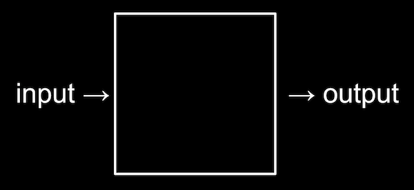
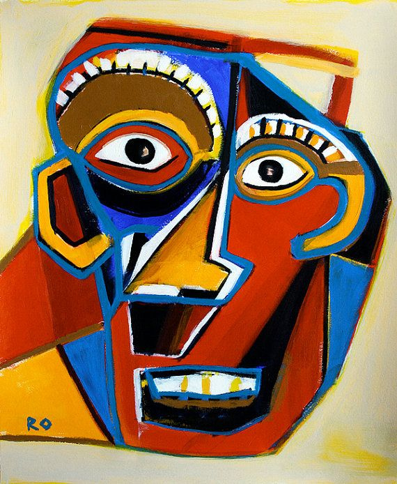

# What is **Computer Science**?

fundamentally about *problem-solving*

---

---

## What is an ***Abstraction***?

---

### Example: Abstract Art

---

## Vocabulary

* **Abstraction**: the process of reducing complexity by focusing on the main idea.
* "hides" away the details of how something was made or how it works (its *implementation*)

---

## Examples?
