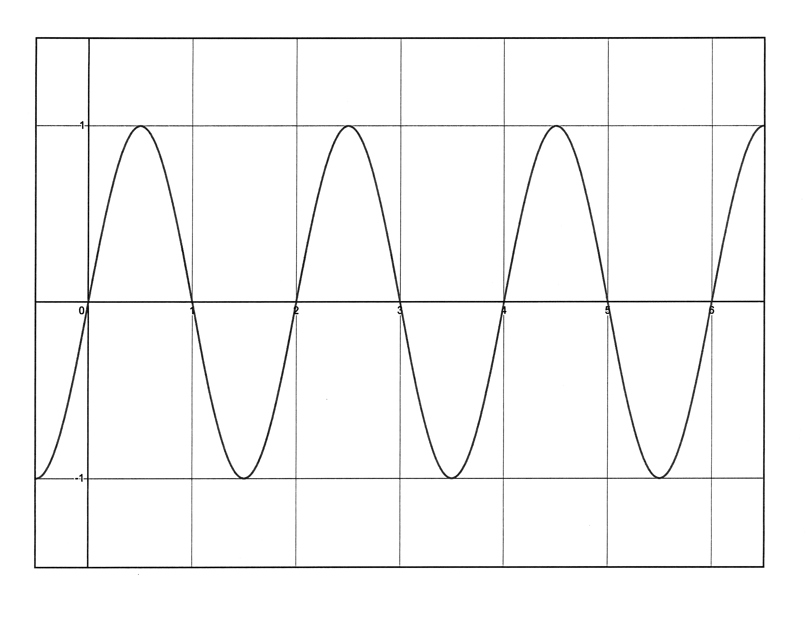
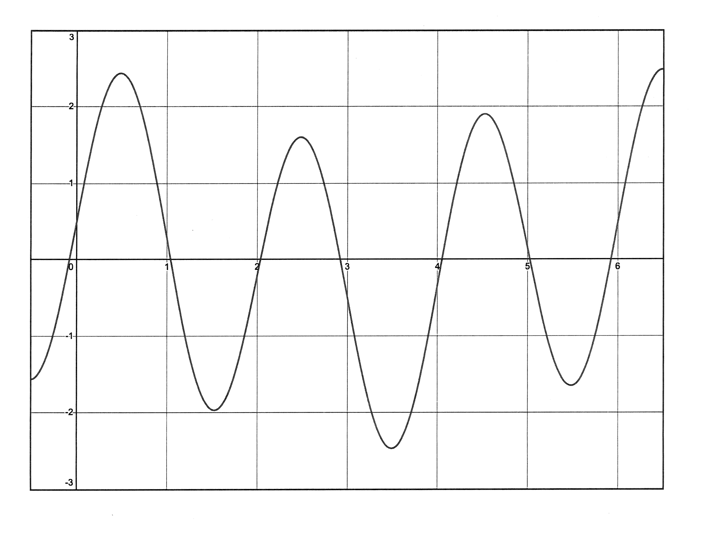

# **Information Layer**

AP CSP @ SouthLake Christian Academy

---

## **Analog and Digital Data**

---

* **digital data**: data represented as `0`s and `1`s
    * defined at a set time interval
* **analog data**: data represented as a continuous signal

We can represent analog data as digital data, but the computer will have to approximate.

---

    
    
    

We can get closer and closer to the real duck, but will never be able to fully and accurately represent the duck on a machine.

---

---

### Audio Format Parameters

* **sampling frequency:** number of times per seconds we take a digital snapshot of what a person would hear
    * often measured in kilohertz (1000 samples a second)

* **bit depth**: number of bits used in each snapshot

* sampling frequency x bit depth = number of bits for one second of music

---

---

---

<table>
    <tr>
        <th colspan="2">1-bit deep</th>
    </tr>
    <tr>
        <th><code>0b0</code></th>
        <th><code>0b1</code></th>
    </tr>
    <tr>
        <td>off</td>
        <td>blaring</td>
    </tr>
</table>  

<table>
    <tr>
        <th colspan="4">2-bit deep</th>
    </tr>
    <tr>
        <th><code>0b00</code></th>
        <th><code>0b01</code></th>
        <th><code>0b10</code></th>
        <th><code>0b11</code></th>
    </tr>
    <tr>
        <td>off</td>
        <td>whisper</td>
        <td>comfy</td>
        <td>blaring</td>
    </tr>
</table>

---

If your song is recorded in a 32-bit audio format, and your song was recorded at 44.1kHz (44100 samples a second), how many bits are required to store your 7 minute song?

---

### Audio Formats

* MIDI: **M**usical **I**nstrument **D**igital **I**nterface
    * way to describe pitch and duration of note
    * computer synthesizes these notes
    * not an actual recording

* For *recorded music*, MIDI, AAC, MP3, WAV formats
    * WAV is uncompressed &rarr; high quality
    * MP3 is compressed &rarr; lower quality
        * Which type of compression?

---

### Image Formats

* GIF: **G**raphics **I**nterchange **F**ormat
    * low-quality, 8-bit color, can be animated
* JPEG &rarr; lossy compression, 24-bit color
* PNG &rarr; lossless compression, 24-bit color
* SVG describes equations

---

## **Metadata**

**metadata**: data about data

image formats will contain not only the raw binary data, but also information about:

* when the image was created
* when the image was last modified
* when the picture was taken
* where the picture was taken
* the size of the image
* the type of color scheme used
    * black and white, or color