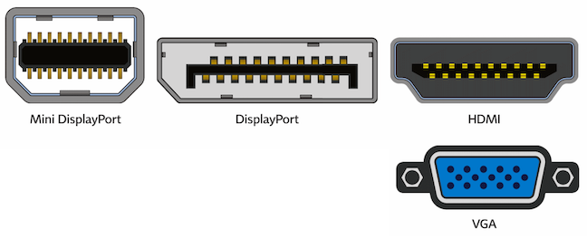

# **Hardware Layer**

AP CSP @ SouthLake Christian Academy

---

The data we've been discussing so far is stored on physics devices -- the computer's hardware.

---

Inside a Computer Video

<https://youtu.be/HB4I2CgkcCo>

---

## **CPU**

**CPU** is the computer's central processing unit

* the "brain"
* performs math in numbers fed to it
* helps display numbers on a screen
* adds or deletes numbers

---

### **Cores**

Back in the old days (pre-2001), CPUs only had 1 *core*. Nowadays, CPUs are multi-core.

A **core** is the piece of the CPU that actually performs mathematical operations. More cores &rarr; more jobs completed at once.

---

---

## **Memory**

While the CPU performs calculations, **memory** is where our data is stored.

---

## **Registers**

registers are the smallest blocks of memory

* fastest type of memory
* very expensive
* accessed by CPU for calculations

---

### **RAM**

**RAM**: random access memory

* files, programs, images are stored on these chips
    * stores data when computer is *on*
    * data not preserved when computer is *off*
* fast access times

---

---

If you have only 8 GB worth of memory, and a software performs best with 16 GB, your program will run very slowly!

---

### **HDDs**

When your computer turns off, we want our data to not be erased!

* Hard drive disks store data on magnetized particles embedded onto disks
    * a north pole represents `1`, south pole represents `0`
    * dropping harddrive can cause particles to demagnetize
    * exposing to air renders HDDs useless

---

#### Slow Motion Video

<https://youtu.be/cFRLXvihlU8>

---

### **SSDs**

When your computer turns off, we want our data to not be erased!

* Solid state drives are smaller than HDDs
* No moving plates
    * corruption less likely if dropped
* Much faster than HDDs
* Don't last as long as HDDs

Both SSDs and HDDs are slower than RAM!

---

## **Memory Hierarchy**

how memory is retrieved from:

* cloud/network storage (ex: Google Drive)
* local storage (ex: HDDs)
* registers

and funneled to CPU

---

---

## **Display Connectors**

* Mini DisplayPort &rarr; computer displays
* HDMI &rarr; computer displays and TVs
* VGA &rarr; older computer displays and projectors

---

## **USB**

**U**niversal **S**erial **B**us

* Can plug in a whole range of peripheral devices including printers, keyboards, mice, scanners, etc.

* Hard drives can connect via USB
    * Even if a hard drive is fast, if the USB is slow, the transfer of data will be slow

---

---

## **WIFI & Bluetooth**

* Wifi gives acces to internet
* Bluetooth allows devices such as wireless keyboards and headphones to connect to your computer
    * Limited range
    * This is ok as it is used for you to connect to your own device
* Both use radio waves to transmit data
